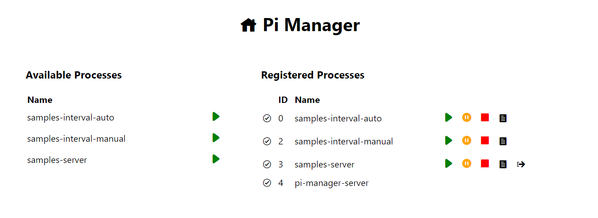
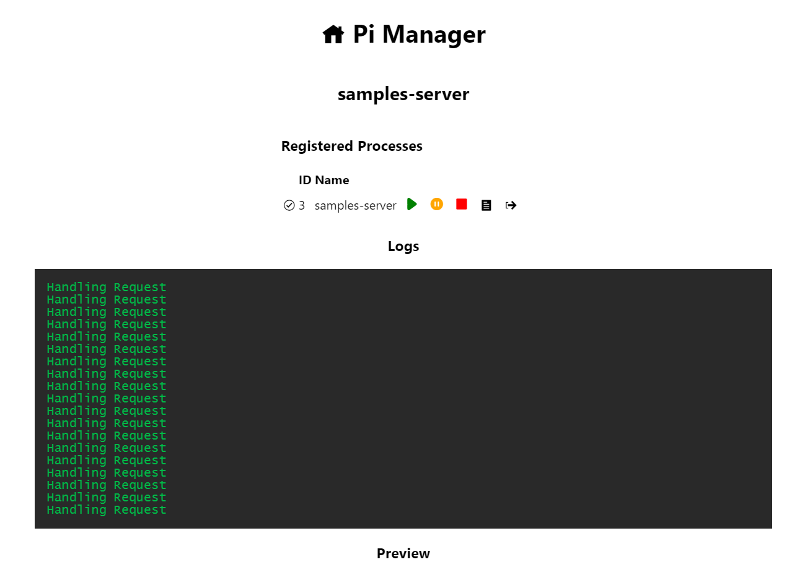
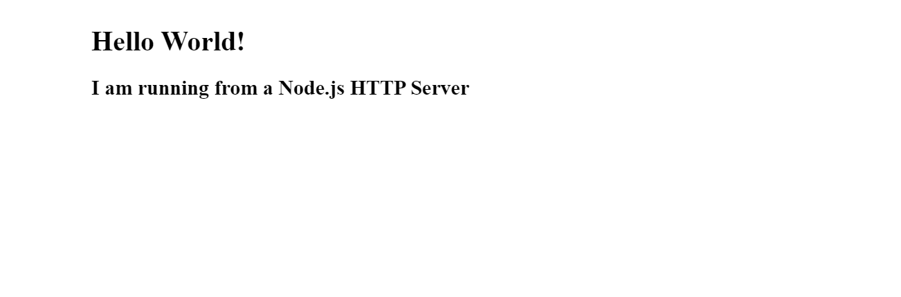

# Pi Manager

Pi Manager is a light weight process management application for Raspberry Pi that runs on [Next.js](https://github.com/vercel/next.js/) and [PM2](https://github.com/Unitech/pm2). The application allows you to easily view logs and manage the lifecycle of defined scripts/processes running on your Raspberry Pi (or any server really). It even works on mobile!

Pi Manager provides an interface for viewing the processes you've identified for it to manage:



As well as view logs, preview an application, and manage it's lifecycle:




## Prerequisites

- Node.js installed on the Raspberry Pi / Server

## Getting Started

1. Clone this application
2. Run `yarn install`
3. Configure your application startup scripts in the `process.config.json` file, this makes use of the [PM2 config format](https://pm2.keymetrics.io/docs/usage/pm2-doc-single-page/#ecosystem-file) with the following additional properties:

- `startup`: `true` or `false`, should the app initialize when the server starts
- `port`: (optional) port that a given application runs on, useful for linking out to the application

An example configuration can be seen below:

```json
[
  {
    "name": "samples-interval-auto",
    "startup": true,
    "script": "./samples/interval.js",
    "logDateFormat": "MM-DD HH:mm:ss",
    "port": 1234
  },
  {
    // another app config
  }
]
```

The above configuration sets up the following:

- A process named `samples-interval-auto`
- That will automatically `startup` with the server
- A relative path to the `script` to run to start the process
- With the provided `lodDateFormat` to include date information in the log file
- That's exposed on `port` `1234`

> If possible try to use absolute script paths, you may have trouble getting relatives to work as expected sometimes, modifying the config file will also require a rebuild to take effect

3. Once you've configured your application build the app with `yarn build`
4. Start the application using PM2 to manage the server process with `yarn start:prod`

> Alternatively, have the app run without the app being kept up by PM2 (not recommended) using `yarn start`

5. You can now open the application server on `http://localhost:3000`

> Note that in a Production environment you would use the server's (or Raspberry Pi's) IP/Hostname to access the application (it's really just a web app)

## Development and Contributing

To work on the application you should have a bit of familiarity with React.js, some basic knowledge of Next.js and PM2 are helpful but not required

The application makes use of a Next.js application connected to PM2 via the PM2 Node.js API

For development you need to do the following:

1. Clone the Repo
2. Install dependencies with `yarn install`
3. Start the application in development mode with `yarn develop`
4. Change some files, make some commits, push some code - feel free to create a Pull Request or an Issue if you have any ideas you'd like to contribute
